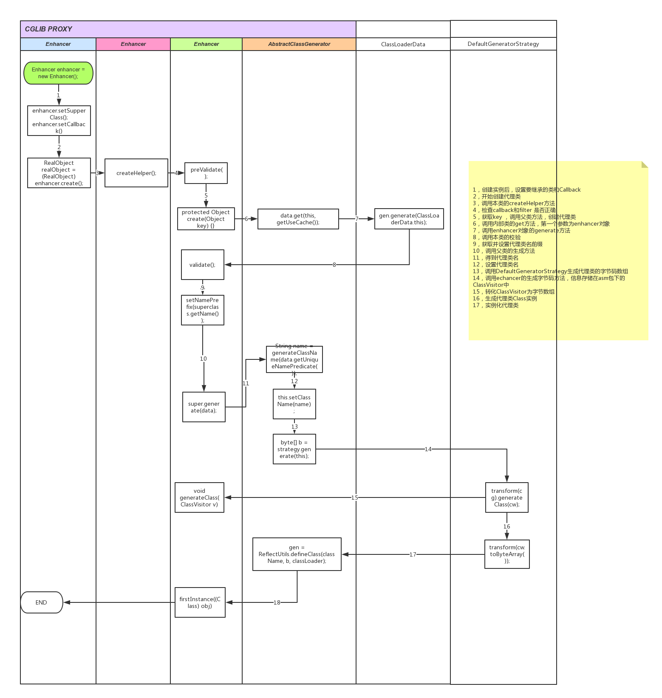
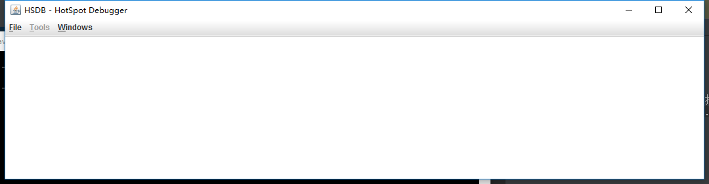
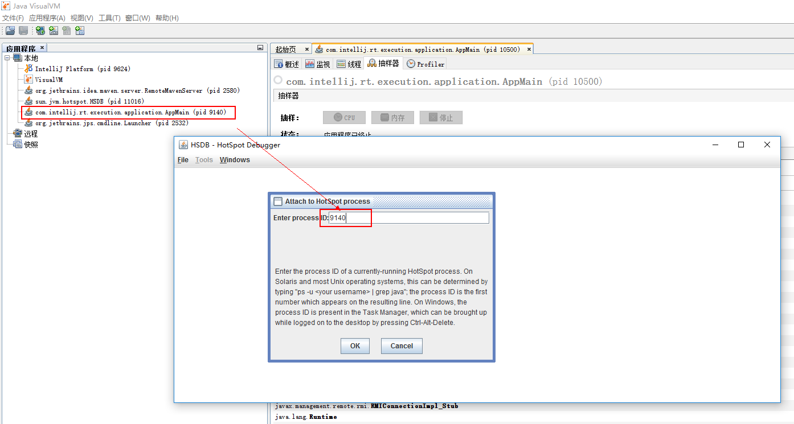
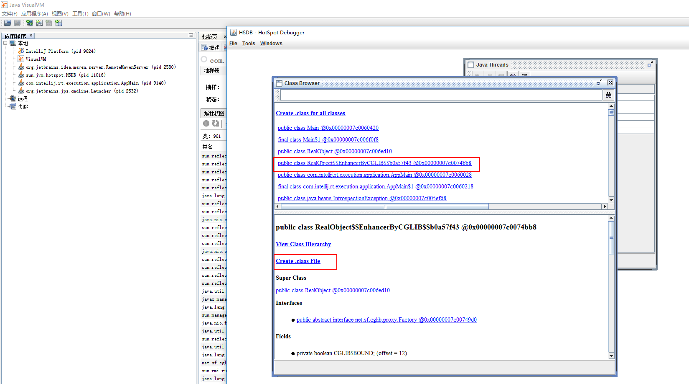
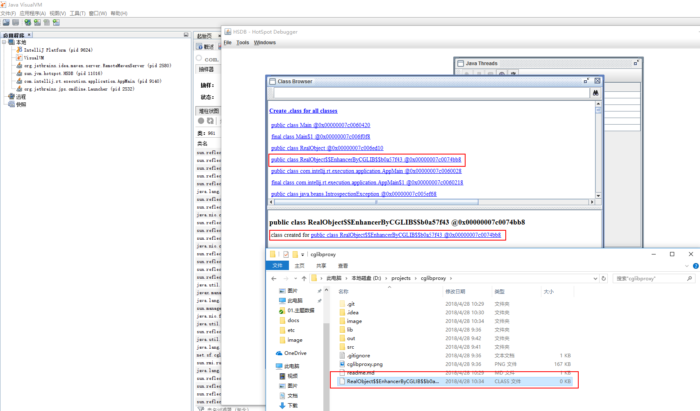

jdk 1.8
cglib 3.2.6
asm 6.0  

查看cglib生成的代理类文件  

0.%JDK_HOME%下搜索sawindbg.dll,拷贝到%JDK_HOME%\jre\bin下

1.进入项目目录，打开命令行，执行命令,打开hotspot debug
``java -classpath "%JAVA_HOME%\lib\sa-jdi.jar" sun.jvm.hotspot.HSDB``
  
2.点击“File”->“attach to hotspot process”,弹出对话框，输入进程PID
  
3.点击“tools” ->“Class Browser”，找到代理类，点击此类，在下方再点击“Create .class file”,生成文件到磁盘

4.
  
5.反编译(JD-GUI)，生成类内容如下
<pre>
import java.lang.reflect.Method;
import net.sf.cglib.proxy.Callback;
import net.sf.cglib.proxy.Factory;
import net.sf.cglib.proxy.MethodInterceptor;
import net.sf.cglib.proxy.MethodProxy;

public class RealObject$$EnhancerByCGLIB$$b0a57f43
  extends RealObject
  implements Factory
{
  private boolean CGLIB$BOUND;
  public static Object CGLIB$FACTORY_DATA;
  private static final ThreadLocal CGLIB$THREAD_CALLBACKS;
  private static final Callback[] CGLIB$STATIC_CALLBACKS;
  private MethodInterceptor CGLIB$CALLBACK_0;
  private static Object CGLIB$CALLBACK_FILTER;
  private static final Method CGLIB$init$0$Method;
  private static final MethodProxy CGLIB$init$0$Proxy;
  private static final Object[] CGLIB$emptyArgs;
  private static final Method CGLIB$sayHello$1$Method;
  private static final MethodProxy CGLIB$sayHello$1$Proxy;
  private static final Method CGLIB$equals$2$Method;
  private static final MethodProxy CGLIB$equals$2$Proxy;
  private static final Method CGLIB$toString$3$Method;
  private static final MethodProxy CGLIB$toString$3$Proxy;
  private static final Method CGLIB$hashCode$4$Method;
  private static final MethodProxy CGLIB$hashCode$4$Proxy;
  private static final Method CGLIB$clone$5$Method;
  private static final MethodProxy CGLIB$clone$5$Proxy;
  
  public RealObject$$EnhancerByCGLIB$$b0a57f43()
  {
    CGLIB$BIND_CALLBACKS(this);
  }
  
  static {}
  
  public final boolean equals(Object paramObject)
  {
    MethodInterceptor tmp4_1 = this.CGLIB$CALLBACK_0;
    if (tmp4_1 == null)
    {
      tmp4_1;
      CGLIB$BIND_CALLBACKS(this);
    }
    MethodInterceptor tmp17_14 = this.CGLIB$CALLBACK_0;
    if (tmp17_14 != null)
    {
      Object tmp41_36 = tmp17_14.intercept(this, CGLIB$equals$2$Method, new Object[] { paramObject }, CGLIB$equals$2$Proxy);
      tmp41_36;
      return tmp41_36 == null ? false : ((Boolean)tmp41_36).booleanValue();
    }
    return super.equals(paramObject);
  }
  
  public final String toString()
  {
    MethodInterceptor tmp4_1 = this.CGLIB$CALLBACK_0;
    if (tmp4_1 == null)
    {
      tmp4_1;
      CGLIB$BIND_CALLBACKS(this);
    }
    MethodInterceptor tmp17_14 = this.CGLIB$CALLBACK_0;
    if (tmp17_14 != null) {
      return (String)tmp17_14.intercept(this, CGLIB$toString$3$Method, CGLIB$emptyArgs, CGLIB$toString$3$Proxy);
    }
    return super.toString();
  }
  
  public final int hashCode()
  {
    MethodInterceptor tmp4_1 = this.CGLIB$CALLBACK_0;
    if (tmp4_1 == null)
    {
      tmp4_1;
      CGLIB$BIND_CALLBACKS(this);
    }
    MethodInterceptor tmp17_14 = this.CGLIB$CALLBACK_0;
    if (tmp17_14 != null)
    {
      Object tmp36_31 = tmp17_14.intercept(this, CGLIB$hashCode$4$Method, CGLIB$emptyArgs, CGLIB$hashCode$4$Proxy);
      tmp36_31;
      return tmp36_31 == null ? 0 : ((Number)tmp36_31).intValue();
    }
    return super.hashCode();
  }
  
  protected final Object clone()
    throws CloneNotSupportedException
  {
    MethodInterceptor tmp4_1 = this.CGLIB$CALLBACK_0;
    if (tmp4_1 == null)
    {
      tmp4_1;
      CGLIB$BIND_CALLBACKS(this);
    }
    MethodInterceptor tmp17_14 = this.CGLIB$CALLBACK_0;
    if (tmp17_14 != null) {
      return tmp17_14.intercept(this, CGLIB$clone$5$Method, CGLIB$emptyArgs, CGLIB$clone$5$Proxy);
    }
    return super.clone();
  }
  
  /* Error */
  public Object newInstance(Class[] arg1, Object[] arg2, Callback[] arg3)
  {
    // Byte code:
    //   0: aload_3
    //   1: invokestatic 209	RealObject$$EnhancerByCGLIB$$b0a57f43:CGLIB$SET_THREAD_CALLBACKS	([Lnet/sf/cglib/proxy/Callback;)V
    //   4: new 2	RealObject$$EnhancerByCGLIB$$b0a57f43
    //   7: dup
    //   8: aload_1
    //   9: dup
    //   10: arraylength
    //   11: tableswitch	default:+24->35, 0:+17->28
    //   28: pop
    //   29: invokespecial 210	RealObject$$EnhancerByCGLIB$$b0a57f43:<init>	()V
    //   32: goto +17 -> 49
    //   35: goto +3 -> 38
    //   38: pop
    //   39: new 216	java/lang/IllegalArgumentException
    //   42: dup
    //   43: ldc -38
    //   45: invokespecial 220	java/lang/IllegalArgumentException:<init>	(Ljava/lang/String;)V
    //   48: athrow
    //   49: aconst_null
    //   50: invokestatic 209	RealObject$$EnhancerByCGLIB$$b0a57f43:CGLIB$SET_THREAD_CALLBACKS	([Lnet/sf/cglib/proxy/Callback;)V
    //   53: areturn
  }
  
  public Object newInstance(Callback paramCallback)
  {
    CGLIB$SET_THREAD_CALLBACKS(new Callback[] { paramCallback });
    CGLIB$SET_THREAD_CALLBACKS(null);
    return new b0a57f43();
  }
  
  public Object newInstance(Callback[] paramArrayOfCallback)
  {
    CGLIB$SET_THREAD_CALLBACKS(paramArrayOfCallback);
    CGLIB$SET_THREAD_CALLBACKS(null);
    return new b0a57f43();
  }
  
  public final void init()
  {
    MethodInterceptor tmp4_1 = this.CGLIB$CALLBACK_0;
    if (tmp4_1 == null)
    {
      tmp4_1;
      CGLIB$BIND_CALLBACKS(this);
    }
    if (this.CGLIB$CALLBACK_0 != null) {
      return;
    }
    super.init();
  }
  
  public final void sayHello(String paramString)
  {
    MethodInterceptor tmp4_1 = this.CGLIB$CALLBACK_0;
    if (tmp4_1 == null)
    {
      tmp4_1;
      CGLIB$BIND_CALLBACKS(this);
    }
    if (this.CGLIB$CALLBACK_0 != null) {
      return;
    }
    super.sayHello(paramString);
  }
  
  public void setCallback(int paramInt, Callback paramCallback)
  {
    switch (paramInt)
    {
    case 0: 
      this.CGLIB$CALLBACK_0 = ((MethodInterceptor)paramCallback);
      break;
    }
  }
  
  public void setCallbacks(Callback[] paramArrayOfCallback)
  {
    this.CGLIB$CALLBACK_0 = ((MethodInterceptor)paramArrayOfCallback[0]);
  }
  
  public Callback getCallback(int paramInt)
  {
    CGLIB$BIND_CALLBACKS(this);
    switch (paramInt)
    {
    case 0: 
      break;
    }
    return null;
  }
  
  public Callback[] getCallbacks()
  {
    CGLIB$BIND_CALLBACKS(this);
    return new Callback[] { this.CGLIB$CALLBACK_0 };
  }
  
  public static void CGLIB$SET_THREAD_CALLBACKS(Callback[] paramArrayOfCallback)
  {
    CGLIB$THREAD_CALLBACKS.set(paramArrayOfCallback);
  }
  
  public static void CGLIB$SET_STATIC_CALLBACKS(Callback[] paramArrayOfCallback)
  {
    CGLIB$STATIC_CALLBACKS = paramArrayOfCallback;
  }
  
  /* Error */
  public static MethodProxy CGLIB$findMethodProxy(net.sf.cglib.core.Signature arg0)
  {
    // Byte code:
    //   0: aload_0
    //   1: invokevirtual 130	java/lang/Object:toString	()Ljava/lang/String;
    //   4: dup
    //   5: invokevirtual 131	java/lang/Object:hashCode	()I
    //   8: lookupswitch	default:+132->140, -508378822:+60->68, 771401912:+72->80, 1826985398:+84->92, 1913648695:+96->104, 1948277861:+108->116, 1984935277:+120->128
    //   68: ldc -123
    //   70: invokevirtual 134	java/lang/Object:equals	(Ljava/lang/Object;)Z
    //   73: ifeq +68 -> 141
    //   76: getstatic 127	RealObject$$EnhancerByCGLIB$$b0a57f43:CGLIB$clone$5$Proxy	Lnet/sf/cglib/proxy/MethodProxy;
    //   79: areturn
    //   80: ldc -120
    //   82: invokevirtual 134	java/lang/Object:equals	(Ljava/lang/Object;)Z
    //   85: ifeq +56 -> 141
    //   88: getstatic 68	RealObject$$EnhancerByCGLIB$$b0a57f43:CGLIB$sayHello$1$Proxy	Lnet/sf/cglib/proxy/MethodProxy;
    //   91: areturn
    //   92: ldc -118
    //   94: invokevirtual 134	java/lang/Object:equals	(Ljava/lang/Object;)Z
    //   97: ifeq +44 -> 141
    //   100: getstatic 81	RealObject$$EnhancerByCGLIB$$b0a57f43:CGLIB$equals$2$Proxy	Lnet/sf/cglib/proxy/MethodProxy;
    //   103: areturn
    //   104: ldc -116
    //   106: invokevirtual 134	java/lang/Object:equals	(Ljava/lang/Object;)Z
    //   109: ifeq +32 -> 141
    //   112: getstatic 98	RealObject$$EnhancerByCGLIB$$b0a57f43:CGLIB$toString$3$Proxy	Lnet/sf/cglib/proxy/MethodProxy;
    //   115: areturn
    //   116: ldc -114
    //   118: invokevirtual 134	java/lang/Object:equals	(Ljava/lang/Object;)Z
    //   121: ifeq +20 -> 141
    //   124: getstatic 49	RealObject$$EnhancerByCGLIB$$b0a57f43:CGLIB$init$0$Proxy	Lnet/sf/cglib/proxy/MethodProxy;
    //   127: areturn
    //   128: ldc -112
    //   130: invokevirtual 134	java/lang/Object:equals	(Ljava/lang/Object;)Z
    //   133: ifeq +8 -> 141
    //   136: getstatic 109	RealObject$$EnhancerByCGLIB$$b0a57f43:CGLIB$hashCode$4$Proxy	Lnet/sf/cglib/proxy/MethodProxy;
    //   139: areturn
    //   140: pop
    //   141: aconst_null
    //   142: areturn
  }
  
  final int CGLIB$hashCode$4()
  {
    return super.hashCode();
  }
  
  final Object CGLIB$clone$5()
    throws CloneNotSupportedException
  {
    return super.clone();
  }
  
  final void CGLIB$init$0()
  {
    super.init();
  }
  
  final void CGLIB$sayHello$1(String paramString)
  {
    super.sayHello(paramString);
  }
  
  final boolean CGLIB$equals$2(Object paramObject)
  {
    return super.equals(paramObject);
  }
  
  final String CGLIB$toString$3()
  {
    return super.toString();
  }
  
  private static final void CGLIB$BIND_CALLBACKS(Object paramObject)
  {
    b0a57f43 localb0a57f43 = (b0a57f43)paramObject;
    if (!localb0a57f43.CGLIB$BOUND)
    {
      localb0a57f43.CGLIB$BOUND = true;
      Object tmp23_20 = CGLIB$THREAD_CALLBACKS.get();
      if (tmp23_20 == null)
      {
        tmp23_20;
        CGLIB$STATIC_CALLBACKS;
      }
      localb0a57f43.CGLIB$CALLBACK_0 = (tmp31_28 == null ? tmp31_28 : (MethodInterceptor)((Callback[])tmp23_20)[0]);
    }
  }
  
  /* Error */
  static void CGLIB$STATICHOOK1()
  {
    // Byte code:
    //   0: new 22	java/lang/ThreadLocal
    //   3: dup
    //   4: invokespecial 25	java/lang/ThreadLocal:<init>	()V
    //   7: putstatic 27	RealObject$$EnhancerByCGLIB$$b0a57f43:CGLIB$THREAD_CALLBACKS	Ljava/lang/ThreadLocal;
    //   10: iconst_0
    //   11: anewarray 66	java/lang/Object
    //   14: putstatic 47	RealObject$$EnhancerByCGLIB$$b0a57f43:CGLIB$emptyArgs	[Ljava/lang/Object;
    //   17: ldc -109
    //   19: invokestatic 153	java/lang/Class:forName	(Ljava/lang/String;)Ljava/lang/Class;
    //   22: astore_0
    //   23: bipush 8
    //   25: anewarray 70	java/lang/String
    //   28: dup
    //   29: iconst_0
    //   30: ldc -102
    //   32: aastore
    //   33: dup
    //   34: iconst_1
    //   35: ldc -101
    //   37: aastore
    //   38: dup
    //   39: iconst_2
    //   40: ldc -100
    //   42: aastore
    //   43: dup
    //   44: iconst_3
    //   45: ldc -99
    //   47: aastore
    //   48: dup
    //   49: iconst_4
    //   50: ldc -98
    //   52: aastore
    //   53: dup
    //   54: iconst_5
    //   55: ldc -97
    //   57: aastore
    //   58: dup
    //   59: bipush 6
    //   61: ldc -96
    //   63: aastore
    //   64: dup
    //   65: bipush 7
    //   67: ldc -95
    //   69: aastore
    //   70: ldc -93
    //   72: invokestatic 153	java/lang/Class:forName	(Ljava/lang/String;)Ljava/lang/Class;
    //   75: dup
    //   76: astore_1
    //   77: invokevirtual 167	java/lang/Class:getDeclaredMethods	()[Ljava/lang/reflect/Method;
    //   80: invokestatic 173	net/sf/cglib/core/ReflectUtils:findMethods	([Ljava/lang/String;[Ljava/lang/reflect/Method;)[Ljava/lang/reflect/Method;
    //   83: dup
    //   84: iconst_0
    //   85: aaload
    //   86: putstatic 79	RealObject$$EnhancerByCGLIB$$b0a57f43:CGLIB$equals$2$Method	Ljava/lang/reflect/Method;
    //   89: aload_1
    //   90: aload_0
    //   91: ldc -101
    //   93: ldc -102
    //   95: ldc -82
    //   97: invokestatic 180	net/sf/cglib/proxy/MethodProxy:create	(Ljava/lang/Class;Ljava/lang/Class;Ljava/lang/String;Ljava/lang/String;Ljava/lang/String;)Lnet/sf/cglib/proxy/MethodProxy;
    //   100: putstatic 81	RealObject$$EnhancerByCGLIB$$b0a57f43:CGLIB$equals$2$Proxy	Lnet/sf/cglib/proxy/MethodProxy;
    //   103: dup
    //   104: iconst_1
    //   105: aaload
    //   106: putstatic 96	RealObject$$EnhancerByCGLIB$$b0a57f43:CGLIB$toString$3$Method	Ljava/lang/reflect/Method;
    //   109: aload_1
    //   110: aload_0
    //   111: ldc -99
    //   113: ldc -100
    //   115: ldc -75
    //   117: invokestatic 180	net/sf/cglib/proxy/MethodProxy:create	(Ljava/lang/Class;Ljava/lang/Class;Ljava/lang/String;Ljava/lang/String;Ljava/lang/String;)Lnet/sf/cglib/proxy/MethodProxy;
    //   120: putstatic 98	RealObject$$EnhancerByCGLIB$$b0a57f43:CGLIB$toString$3$Proxy	Lnet/sf/cglib/proxy/MethodProxy;
    //   123: dup
    //   124: iconst_2
    //   125: aaload
    //   126: putstatic 107	RealObject$$EnhancerByCGLIB$$b0a57f43:CGLIB$hashCode$4$Method	Ljava/lang/reflect/Method;
    //   129: aload_1
    //   130: aload_0
    //   131: ldc -97
    //   133: ldc -98
    //   135: ldc -74
    //   137: invokestatic 180	net/sf/cglib/proxy/MethodProxy:create	(Ljava/lang/Class;Ljava/lang/Class;Ljava/lang/String;Ljava/lang/String;Ljava/lang/String;)Lnet/sf/cglib/proxy/MethodProxy;
    //   140: putstatic 109	RealObject$$EnhancerByCGLIB$$b0a57f43:CGLIB$hashCode$4$Proxy	Lnet/sf/cglib/proxy/MethodProxy;
    //   143: dup
    //   144: iconst_3
    //   145: aaload
    //   146: putstatic 125	RealObject$$EnhancerByCGLIB$$b0a57f43:CGLIB$clone$5$Method	Ljava/lang/reflect/Method;
    //   149: aload_1
    //   150: aload_0
    //   151: ldc -95
    //   153: ldc -96
    //   155: ldc -73
    //   157: invokestatic 180	net/sf/cglib/proxy/MethodProxy:create	(Ljava/lang/Class;Ljava/lang/Class;Ljava/lang/String;Ljava/lang/String;Ljava/lang/String;)Lnet/sf/cglib/proxy/MethodProxy;
    //   160: putstatic 127	RealObject$$EnhancerByCGLIB$$b0a57f43:CGLIB$clone$5$Proxy	Lnet/sf/cglib/proxy/MethodProxy;
    //   163: pop
    //   164: iconst_4
    //   165: anewarray 70	java/lang/String
    //   168: dup
    //   169: iconst_0
    //   170: ldc -72
    //   172: aastore
    //   173: dup
    //   174: iconst_1
    //   175: ldc -71
    //   177: aastore
    //   178: dup
    //   179: iconst_2
    //   180: ldc -70
    //   182: aastore
    //   183: dup
    //   184: iconst_3
    //   185: ldc -69
    //   187: aastore
    //   188: ldc -68
    //   190: invokestatic 153	java/lang/Class:forName	(Ljava/lang/String;)Ljava/lang/Class;
    //   193: dup
    //   194: astore_1
    //   195: invokevirtual 167	java/lang/Class:getDeclaredMethods	()[Ljava/lang/reflect/Method;
    //   198: invokestatic 173	net/sf/cglib/core/ReflectUtils:findMethods	([Ljava/lang/String;[Ljava/lang/reflect/Method;)[Ljava/lang/reflect/Method;
    //   201: dup
    //   202: iconst_0
    //   203: aaload
    //   204: putstatic 45	RealObject$$EnhancerByCGLIB$$b0a57f43:CGLIB$init$0$Method	Ljava/lang/reflect/Method;
    //   207: aload_1
    //   208: aload_0
    //   209: ldc -71
    //   211: ldc -72
    //   213: ldc -67
    //   215: invokestatic 180	net/sf/cglib/proxy/MethodProxy:create	(Ljava/lang/Class;Ljava/lang/Class;Ljava/lang/String;Ljava/lang/String;Ljava/lang/String;)Lnet/sf/cglib/proxy/MethodProxy;
    //   218: putstatic 49	RealObject$$EnhancerByCGLIB$$b0a57f43:CGLIB$init$0$Proxy	Lnet/sf/cglib/proxy/MethodProxy;
    //   221: dup
    //   222: iconst_1
    //   223: aaload
    //   224: putstatic 64	RealObject$$EnhancerByCGLIB$$b0a57f43:CGLIB$sayHello$1$Method	Ljava/lang/reflect/Method;
    //   227: aload_1
    //   228: aload_0
    //   229: ldc -69
    //   231: ldc -70
    //   233: ldc -66
    //   235: invokestatic 180	net/sf/cglib/proxy/MethodProxy:create	(Ljava/lang/Class;Ljava/lang/Class;Ljava/lang/String;Ljava/lang/String;Ljava/lang/String;)Lnet/sf/cglib/proxy/MethodProxy;
    //   238: putstatic 68	RealObject$$EnhancerByCGLIB$$b0a57f43:CGLIB$sayHello$1$Proxy	Lnet/sf/cglib/proxy/MethodProxy;
    //   241: pop
    //   242: return
    //   243: athrow
  }
}
</pre>
